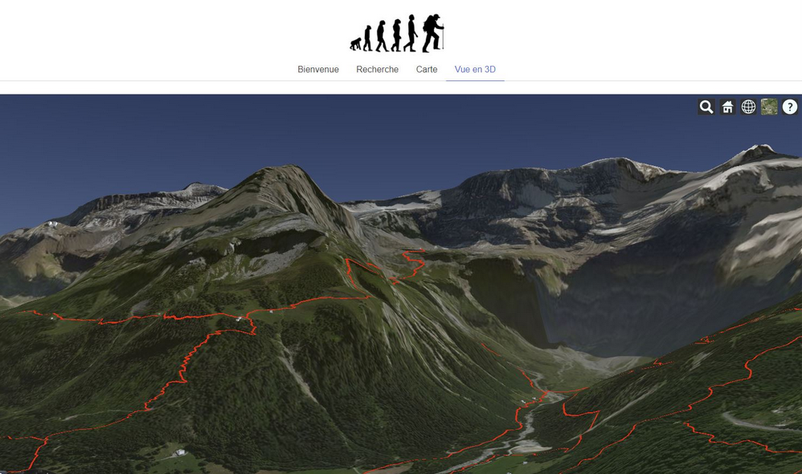
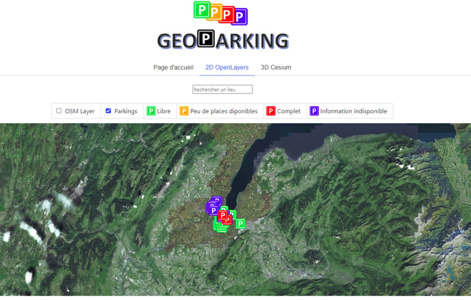
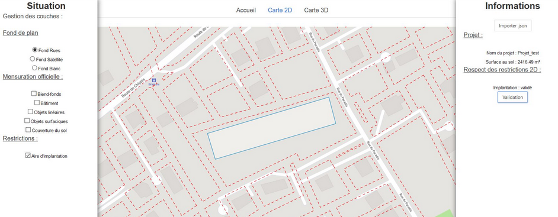
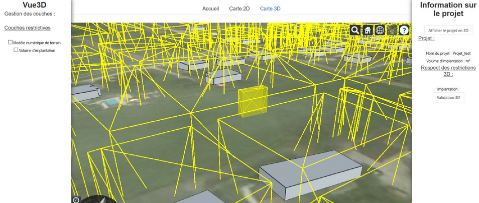

# Introduction

<!-- slide-front-matter class: center, middle -->

## Summary

Learn more about this course

<!-- slide-include ../../BANNER.md -->

<!-- START doctoc generated TOC please keep comment here to allow auto update -->
<!-- DON'T EDIT THIS SECTION, INSTEAD RE-RUN doctoc TO UPDATE -->

- [Lecturers](#lecturers)
- [Prerequisite](#prerequisite)
- [Expectations](#expectations)
- [Web development?](#web-development)
- [Goals](#goals)
- [Program](#program)
- [Group project](#group-project)
- [
**Design a 2D&3D geoportal**
](#div-aligncenterdesign-a-2d3d-geoportaldiv)
- [Functionalities](#functionalities)
- [
 **Be creative!**
](#div-aligncenter-be-creativediv)
- [Technologies](#technologies)
- [Cesium](#cesium)
- [2D functionality examples](#2d-functionality-examples)
- [3D functionality examples](#3d-functionality-examples)
- [@Todo](#todo)

<!-- END doctoc generated TOC please keep comment here to allow auto update -->

## Lecturers

- Mathias Oberson, Square Services
- Jens Ingensand, HEIG-VD
- Thibaud Chassin, HEIG-VD / EPFL

## Prerequisite

- Basics of HTML, CSS and JavaScript
- Basics of Object Oriented Programming [OOP][oop]
- Experience with geodata
- Use of command line

[oop]: https://www.datacamp.com/community/tutorials/python-oop-tutorial/

## Expectations

- What is your experience? (e.g. programming languages, use at work)
- What are your expectations?

## Web development?

- Utilization of web tools in the field of geomatics is increasing (e.g. geoportals, etc)
- Increasing processing power on the client (more memory, faster cpu's)
- Mobile development (e.g. using [Apache Cordova][cordova])

## Goals

- Learn to structure code: Code principles, Design patterns, Architectural patterns
-> Easy to apply to other programming languages
- Versioning tools: GIT
-> Working together on code; create branches, etc
- Utilization of a web framework with geodata (!= simply using a web cartography framework)
-> Web frameworks increasingly important (e.g. Angular, Vue JS, etc)

[cordova]: https://cordova.apache.org/

## Program

| #   | #Lessons | Date       | Subject                                                 |
| --- | -------- | ---------- | ------------------------------------------------------- |
| 1   | 2        | 23.9.2021  | Introduction, program                                   |
| 2   | 2        | 30.9.2021  | Code structure, design patterns, architectural patterns, forming groups |
| 3   | 2        | 7.10.2021  | Code structure, design patterns, architectural patterns, oral presentation |
| 4   | 2        | 15.10.2021 | Versioning tools : GIT (13h15 - 18h05)                  |
| 5   | 2        | 14.10.2021  | No course |
| 6   | 2        | 21.10.2021 | Utilization of a web framework                          |
| 7   | 6        | 28.10.2021 | Utilization of a web framework  !13h15 - 18h05!         |
| 8   | 2        | 4.11.2021 |  No course            |
| 9   | 2        | 18.11.2021  | Utilization of a web framework with geodata                                                 |
| 10  | 2        | 25.11.2021 | Project                                                 |
| 11  | 2        | 2.12.2021 | Project                                                 |
| 12  | 2        | 9.12.2021   | Project                                     |
| 13  | 2        | 16.12.2021   | Project                                     |
| 14  | 2        | 23.12.2021   | Project presentation                                    |

## Group project

**Design a 2D&3D geoportal**

---------------
Example: [geoportail.gouv.fr](https://www.geoportail.gouv.fr) 

## Functionalities
- **Landing page**:
	- Menu
	- Landing information
	- Location search
- **Map page**:
	- A 2D view page
		- Advanced 2D functionality (of your choice)
		- 2D Layers visualization
	- A 3D view page
		- Advanced 3D functionality (of your choice)
		- 3D Layers visualization
- **Additional components/pages**:
	- Team description
	- Documentation

 **Be creative!**

---------------

## Technologies

- Vuejs v3+ [vuejs.org](https://www.vuejs.org)
- Leaflet v1.7+ [leafletjs.com](https://leafletjs.com/) or Openlayers v6.7+ [openlayers.org](https://openlayers.org/)
- Cesium v1.85+ [cesium.com](https://cesium.com/cesiumjs/)

## Cesium

- A WebGL virtual globe for visualizing dynamic data
- Open source
- Updated every month

## 2D functionality examples

- Real-time geolocated tweets: [demo](https://onemilliontweetmap.com/?center=25.505,-0.09&zoom=2&search=&timeStep=0&timeSelector=0&hashtag1=&hashtag2=sad&sidebar=yes&hashtagBattle=0&timeRange=0&timeRange=25&heatmap=0&sun=0&cluster=1)
- Live SBB trains localization visualization: [demo](http://maps.vasile.ch/transit-sbb/)
- Instragram filters on maps: [demo](http://humangeo.github.io/leaflet-tilefilter/demo.html)
- Data filtering: [demo](https://dvorak.shinyapps.io/college_explorer/)

## 3D functionality examples

- Replay drone flight: [demo](https://logs.px4.io/3d?log=7adce484-e6ce-4537-804f-0b386092032b)
- Flight simulator: [demo](https://www.geo-fs.com/geofs.php)
- Underground point clouds: [demo](https://cesium.com/blog/2020/08/25/national-security-hackathon/)

Cesium gallery example with code: [sandcastle](https://sandcastle.cesium.com)

## Last Year projects

Planning hicking routes 

## Last Year projects

Real-time parking occupancy

## Last Year projects

  

  

Cadastral constraints

## @Todo

- **30.09**: Select your groups (3x3)
- **07.10**: 3 min oral presentation of your geoportal mock-up & fonctionalities 
