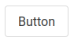
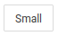
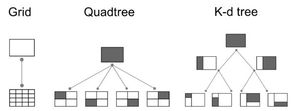
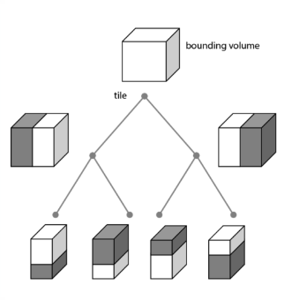

<!-- START doctoc generated TOC please keep comment here to allow auto update -->
<!-- DON'T EDIT THIS SECTION, INSTEAD RE-RUN doctoc TO UPDATE -->


- [Vuejs External librairies](#vuejs-external-librairies)
  - [Router with vue-router](#router-with-vue-router)
  - [Why using a router?](#why-using-a-router)
    - [1 - Router installation](#1---router-installation)
    - [2 - Router configuration](#2---router-configuration)
    - [2.1 - Routes definition](#21---routes-definition)
    - [3 - Router importation](#3---router-importation)
    - [4 - Router use](#4---router-use)
  - [REST API Consumption with Axios](#rest-api-consumption-with-axios)
  - [Why using Axios?](#why-using-axios)
    - [1 - Axios installation](#1---axios-installation)
    - [3 - Axios importation](#3---axios-importation)
    - [4 - Axios use](#4---axios-use)
    - [4 - Axios use](#4---axios-use-1)
  - [Create interactive maps with Leaflet](#create-interactive-maps-with-leaflet)
    - [1 - Leaflet installation](#1---leaflet-installation)
    - [2 - Leaflet importation/use](#2---leaflet-importationuse)
  - [Create dynamic maps with Openlayers](#create-dynamic-maps-with-openlayers)
    - [1 - Openlayers installation](#1---openlayers-installation)
    - [3 - Openlayers importation/use](#3---openlayers-importationuse)
  - [Build web interfaces with Bulma](#build-web-interfaces-with-bulma)
  - [Why using Bulma?](#why-using-bulma)
    - [1 - Bulma installation](#1---bulma-installation)
    - [3 - Bulma importation](#3---bulma-importation)
    - [3 - Start customizing your app !](#3---start-customizing-your-app-)
  - [3D globe with Cesium](#3d-globe-with-cesium)
  - [What is CesiumJS?](#what-is-cesiumjs)
    - [1 - Cesium installation](#1---cesium-installation)
    - [2 - Cesium configuration](#2---cesium-configuration)
    - [3 - Get/Import a Cesium ion token](#3---getimport-a-cesium-ion-token)
    - [3 - Create a 3D globe](#3---create-a-3d-globe)
  - [Play around with cesium's assets](#play-around-with-cesiums-assets)
    - [3D Camera](#3d-camera)
    - [3D Tiles](#3d-tiles)
    - [3D Tiles](#3d-tiles-1)
    - [Imagery:  TMS (Tile Map Service) & WMTS (Web Map Tile Service)](#imagery--tms-tile-map-service--wmts-web-map-tile-service)
    - [Terrain: Quantized Mesh](#terrain-quantized-mesh)
    - [glTF (GL Transmission Format)](#gltf-gl-transmission-format)
  - [Project's seed](#projects-seed)
    - [Sandcastle examples linked to your projects](#sandcastle-examples-linked-to-your-projects)

<!-- END doctoc generated TOC please keep comment here to allow auto update -->

# Vuejs External librairies
<!-- slide-front-matter class: center, middle -->

## Router with vue-router 
<!-- slide-front-matter class: center, middle -->

## Why using a router?

A Single Page Application means that you don't have to refresh your browser when you switch from page to page. However, if you have a multipage application navigating between pages may be essential. That is why you need a router. 

<sup>[**Link to the documentation**][vue-doc-router]</sup>

### 1 - Router installation 

Install **vue-router** via command line at the root of your project:

`npm install vue-router@next`

### 2 - Router configuration 
Add configuration file within your **src/** directory:

`router/index.js`

<br>

<ins>In 4 steps:</ins>
- Imports
- Array routes definition (can be merged within constructor)
- Router constructor
- Export 

<br>

<sup>_Check source link for an example of the configuration file: **Creating our routes**_</sup>

<sup>[**Source**][router-example]</sup>

### 2.1 - Routes definition 

```javascript
{
    path: "/url_path",
    name: "Route_name",
    component: TheComponent,
  }
```

<br>

<ins>Mandatory items:</ins> 
-   **Path** - the URL path where this route can be found.
-   **Name** - An optional name to use when we link to this route.
-   **Component** - Which component to load when this route is called.

### 3 - Router importation 
Add router configuration to your Vuejs application in **main.js**:
````javascript
import { createApp } from 'vue'
import MyAppcomponent from './Appcomponent.vue'
import router from './router'			        //<---- Import

const myVueInstance = createApp(MyAppcomponent)
myVueInstance.use(router) 		           	//<---- Use
myVueInstance.mount('#div-myvueapp')
````

### 4 - Router use 

Use `<router-link>` directive to navigate between your different pages.

<br>


```html
<router-link :to="{ name: 'Route_Name' }">Route_Title</router-link>
```

<br>

<sup>[**Example from scratch**][router-install]  /  [**Further reading**][router-singlepage]</sup>

## REST API Consumption with Axios
<!-- slide-front-matter class: center, middle -->

## Why using Axios?

Axios is a library that makes promise based HTTP requests on the browser. It supports all kinds of requests including GET, POST, PUT & DELETE. It is used to communicate between the front-end and the back-end and/or web services.

<sup>[**Link to the documentation**][axios-doc]</sup>

<br>

[**Further reading**][axios-staydry]

<br>
Alternatively, you can use natively **_Fetch API_**.

### 1 - Axios installation 

Install **axios** via command line at the root of your project:

`npm install axios`

### 3 - Axios importation 
Add axios directly within your vue components:
````javascript
import  axios  from  'axios'
````

### 4 - Axios use 
**GET REQUEST**
```js
  axios.get('BaseURL')
  .then(function (response) {
    // handle success
    console.log(response);
  })
  .catch(function (error) {
    // handle error
    console.log(error);
  });
```

### 4 - Axios use 
**POST REQUEST**
```js
axios.post('BaseURL', yourdata)
  .then(function (response) {
    // handle success
    console.log(response);
  })
  .catch(function (error) {
    // handle error
    console.log(error);
  });
```


## Create interactive maps with Leaflet 
<!-- slide-front-matter class: center, middle -->

### 1 - Leaflet installation 

Install **leaflet** via command line at the root of your project:

` npm install leaflet `

<br>

[**Quick start**][leaflet-quickstart]


### 2 - Leaflet importation/use

Add leaflet directly within your vue components:
````javascript
// Make sure to import Leaflet's CSS before leaflet !
import  "leaflet/dist/leaflet.css"; 	 // <--- use leaflet stylesheet
import  L  from  'leaflet';  		   // <--- access leaflet's methods

// initialize map & tilelayer
````

<sup>[**Link to the documentation**][leaflet-doc]</sup>

<br>

**Do not forget:**
- _Create an HTML container for your map_
- _Define a CSS height for your map container_
- _Add your leaflet map to a Vuejs data_ 
- _Initialize your leaflet map once your component is mounted_

## Create dynamic maps with Openlayers 
<!-- slide-front-matter class: center, middle -->

### 1 - Openlayers installation 

Install **openlayers** via command line at the root of your project:

` npm install ol `

<br>

[**Quick start**][openlayers-quickstart]

### 3 - Openlayers importation/use 
Add openlayers directly within your vue components:
````javascript
import  'ol/ol.css'; 	     	// <--- use ol stylesheet
import  Map  from  'ol/Map'; 	// <--- access Map ol's methods
import  View  from  'ol/View';  // <--- access View ol's methods
			                	// <--- import what you need
				
// initialize map & tilelayer & view
````

<sup>[**Link to the documentation**][openlayers-doc]</sup>

<br>

**Do not forget:**
- _Import the methods that you need_
- _Create an HTML container for your map_
- _Define a CSS height for your map container_
- _Add your ol map to a Vuejs data_ 
- _Initialize your ol map once your component is mounted_

##  Build web interfaces with Bulma 
<!-- slide-front-matter class: center, middle -->

## Why using Bulma?

Bulma is a CSS framework that helps you to **easily** build web interfaces that are **responsive, modular, customizable**.

<sup>[**Link to the documentation**][bulma-doc]</sup>

### 1 - Bulma installation 

Install **Bulma** via command line at the root of your project:

` npm install bulma `

### 3 - Bulma importation
Add bulma directly in your **main.js**, before creating your App:

````javascript
// src/main.js

import  'bulma/css/bulma.css';
````

### 3 - Start customizing your app !

<!-- slide-column -->
- Create a button:
```html 
<button class="button">Button</button>
```

- Change **color** :
```html
<button class="button is-primary">Primary</button>
```

- Change **size**:
```html
<button class="button is-small">Small</button>
```

- Change **style** :
```html
<button class="button is-rounded">Rounded</button>
```
<!-- slide-column 20 -->
<br>
<br>

<br>
<br>
<br>

<br>
<br>
<br>

<br>
<br>
<br>


## 3D globe with Cesium
<!-- slide-front-matter class: center, middle -->

## What is CesiumJS?

CesiumJS is an open source JavaScript library for creating world-class 3D globes and maps. Cesium's robust and performant pipelines tile a diverse data formats. These formats are defined in five types of assets:

-   <ins>3D Tiles</ins>: An open specification for streaming massive heterogeneous 3D geospatial datasets. 
-   <ins>Imagery</ins>: TMS (Tile Map Service) and WMTS (Web Map Tile Service) layers created from raster imagery.
-   <ins>Terrain</ins>: A quantized-mesh tileset created from raster terrain.
-   <ins>glTF</ins>: A binary glTF model.
-   <ins>Native</ins> (i.e. GeoJSON): The data is not processed by the tiling pipeline and is hosted in the same format it was uploaded as.

<sup>[**Source**][cesium-intro-source]</sup>

<sup>[**Link to the documentation**][cesium-doc]</sup>

### 1 - Cesium installation

Install **Cesium** via command line at the root of your project:

`npm install cesium`

### 2 - Cesium configuration

CesiumJS requires a few static files to be hosted on your server. Therefore, we need to inform [webpack][webpack] (module bundler) to use these files.
We should configure webpack to copy the following four directories and serve them as static files:
-   `node_modules/cesium/Build/Cesium/Workers`
-   `node_modules/cesium/Build/Cesium/ThirdParty`
-   `node_modules/cesium/Build/Cesium/Assets`
-   `node_modules/cesium/Build/Cesium/Widgets`

Then, `CESIUM_BASE_URL` must be set where CesiumJS and these four directories are served.

<sup>[**Source**][cesium-config-source]</sup>

Add configuration file within your **src/** directory:

`vue.config.js`   

<sup>[**( Check file )**][gist-vueconfig]</sup>

### 3 - Get/Import a Cesium ion token
- Create an account on Cesium
- Go to your access token tab 
- Copy your token
- Add your token to your app

```js
Cesium.Ion.defaultAccessToken = YOUR_CESIUM_TOKEN
```
- **You are ready to set up your globe !**

### 3 - Create a 3D globe

It's very simple, it works like Leaflet or Openlayers.
```javascript
import "cesium/Build/Cesium/Widgets/widgets.css"; 	 // <--- use Cesium stylesheet
import * as Cesium from 'cesium'; 			         // <--- access Cesium's methods

// initialize Viewer
let viewer = new Cesium.Viewer('your-cesium-div', {	 // <--- Create viewer in a specific div
  terrainProvider: new Cesium.createWorldTerrain() 	 // <--- Add DEM
});
``` 

<br>

**Do not forget:**

-  _Create an HTML container for your globe_
-  _Define a CSS height for your map container_
-  _Add your Cesium globe to a Vuejs data_
-  _Initialize your Cesium globe once your component is mounted_

## Play around with cesium's assets
<!-- slide-front-matter class: center, middle -->

### 3D Camera

The camera is defined by a position, orientation, and view frustum.

```js
// 4. Fly to a position with an orientation using heading, pitch and roll.
viewer.camera.flyTo({
    destination : Cesium.Cartesian3.fromDegrees(`LONGITUDE`, `LATITUDE`, `ALTITUDE`),
    orientation : {
        heading : Cesium.Math.toRadians(`ANGLE_YAW`),
        pitch : Cesium.Math.toRadians(`ANGLE_PITCH`),
        roll : 0.0
    }
});
```
<sup>[**Source**][cesium-doc-camera]</sup>
<!-- slide-column 40 -->


<sup><sup>[**Source**][pic-camera-pos-ori]</sup></sup>
<!-- slide-column 30 -->
> 
<!-- slide-column 30 -->


<sup><sup>[**Source**][pic-camera-angles]</sup></sup>

### 3D Tiles

3D Tiles define a spatial data structure and a set of tile formats designed for 3D and optimized for streaming and rendering. 3D Tile aims at minimizing client-side processing.

<sup>[**Source**][cesium-3dtiles]</sup>

<br><br>
<!-- slide-column 60 -->
In 2D:

<br><br>
[**Further reading (images' source)**][cesium-3dtile-doc]
<!-- slide-column 10 -->
> 
<!-- slide-column 30 -->
In 3D:



### 3D Tiles
<p align="center">
  
</p>
<sup>[**Source**][pic-ion-tile]</sup>

```javascript
let tileddata = new Cesium.Cesium3DTileset({
    url : '/path/to/3d/tileset'
});
viewer.scene.primitives.add(tileddata);

```

Swisstopo provides 3D Tiles for its 3D buildings !

`https://vectortiles0.geo.admin.ch/3d-tiles/ch.swisstopo.swisstlm3d.3d/20201020/tileset.json`

<sup>[**Swisstopo documentation**][swisstopo-buildings]</sup>

### Imagery:  TMS (Tile Map Service) & WMTS (Web Map Tile Service)
Basemap of your 3D globe.
```javascript
viewer.scene.imageryLayers.removeAll();
let basemap = new Cesium.UrlTemplateImageryProvider({
    url : '/path/to/wmts/imagery'
});
viewer.scene.imageryLayers.addImageryProvider(basemap);
```
It works with Swisstopo WMTS too !

`https://wmts.geo.admin.ch/1.0.0/ch.swisstopo.pixelkarte-farbe/default/current/3857/{z}/{x}/{y}.jpeg`

<sup>[**Swisstopo documentation**][swisstopo-imagery]</sup>

### Terrain: Quantized Mesh
DEM used by your globe. A quantized mesh (reindexed mesh) is used to improve rendering performance.
<p align="center">
  
</p>
<sup>[**Source**][cesium-quantatization]  /  [**Further reading**][cesium-qmesh]</sup>

```javascript
let terrain = new Cesium.CesiumTerrainProvider({
    url : '/path/to/terrain/mesh'
});
viewer.terrainProvider = terrain;
```
And it works with Swisstopo terrain tiles too !

`//3d.geo.admin.ch/1.0.0/ch.swisstopo.terrain.3d/default/20200520/4326/`

<sup>[**Swisstopo documentation**][swisstopo-imagery]</sup>

### glTF (GL Transmission Format)

Format to describe 3D models (geometry, textures, lights). It's considered as the "JPEG of 3D". There is two possible file extensions, .gltf (JSON/ASCII) or .glb (binary). 

<sup>[**Source**][gltf-wiki]  /  [**Further reading**][cesium-gltf]</sup>

```js
// Create an hanchor point to import the gtlf model 
let modelMatrix = Cesium.Transforms.eastNorthUpToFixedFrame(
    Cesium.Cartesian3.fromDegrees(`LONGITUDE`, `LATITUDE`, `ALTITUDE`));
let mygltfmodel = Cesium.Model.fromGltf({
    url : `YOUR_GLTF_MODEL_PATH`,
    modelMatrix : modelMatrix,
    scale : `SCALE`
}));
scene.primitives.add(mygltfmodel)
```

## Project's seed
<!-- slide-front-matter class: center, middle -->

[**Let's wrap up !**][seed]

### Sandcastle examples linked to your projects
- Cameras: [demo][demo-camera]

- Gltf objects import: [demo][demo-gltf]

- Geojson import: [demo][demo-geojson]

- Bar visualization from geojson: [demo][demo-bar]

- Clamp to ground: [demo][demo-clampground]

[vue-doc-router]:https://v3.vuejs.org/guide/routing.html#official-router
[router-example]:https://learnvue.co/2020/04/a-first-look-at-vue-router-in-vue3/
[router-singlepage]:https://medium.com/js-dojo/how-to-build-an-spa-using-vue-js-vuex-vuetify-and-firebase-using-vue-router-fc5bd065fe18
[router-install]:https://www.vuemastery.com/blog/vue-router-a-tutorial-for-vue-3/
[axios-doc]:https://github.com/axios/axios
[axios-staydry]:https://css-tricks.com/stay-dry-using-axios-for-api-requests
[leaflet-doc]:https://leafletjs.com/reference-1.7.1.html
[leaflet-quickstart]:https://leafletjs.com/examples/quick-start/
[openlayers-doc]:https://openlayers.org/en/latest/apidoc/
[openlayers-quickstart]:https://openlayers.org/en/latest/doc/quickstart.html
[bulma-doc]:https://bulma.io/documentation/
[cesium-intro-source]:https://observablehq.com/@cintymd/cesiumjs-introduction
[cesium-doc]:http://gitpc.com.cn/Build/Documentation/index.html
[cesium-config-source]:https://cesium.com/docs/tutorials/quick-start/
[cesium-3dtiles]:https://cesium.com/blog/2015/08/10/introducing-3d-tiles/
[cesium-3dtile-doc]:https://docs.opengeospatial.org/cs/18-053r2/18-053r2.html
[cesium-qmesh]:https://github.com/CesiumGS/quantized-mesh
[cesium-quantatization]:https://cesium.com/blog/2015/12/18/terrain-quantization/
[cesium-gltf]:https://www.khronos.org/gltf/
[cesium-doc-camera]:https://cesium.com/docs/cesiumjs-ref-doc/Camera.html?classFilter=camera
[gltf-wiki]:https://en.wikipedia.org/wiki/GlTF
[webpack]:https://webpack.js.org/
[swisstopo-buildings]:https://api3.geo.admin.ch/services/sdiservices.html#d-tiles
[swisstopo-imagery]:https://api3.geo.admin.ch/services/sdiservices.html#wmts
[pic-camera-angles]:https://sites.google.com/site/projectsmartgimbal/home/TechnicalDetail
[pic-camera-pos-ori]:http://dx.doi.org/10.1109/IPIN.2010.5646820
[pic-ion-tile]:https://cesium.com/blog/2018/10/09/ion-3d-tiles-pipeline/
[seed]:https://github.com/thibaud-c/seed-vuejs3.0-carto2D-3D
[demo-camera]:https://sandcastle.cesium.com/?src=Camera.html
[demo-gltf]:https://sandcastle.cesium.com/?src=3D%20Models.html
[demo-geojson]:https://sandcastle.cesium.com/?src=GeoJSON%20and%20TopoJSON.html
[demo-bar]:https://sandcastle.cesium.com/?src=Custom%20DataSource.html
[demo-clampground]:https://sandcastle.cesium.com/?src=Clamp%20to%20Terrain.html
[gist-vueconfig]:https://gist.github.com/thibaud-c/71f6dee3ce69487be5403c619a5914a4

