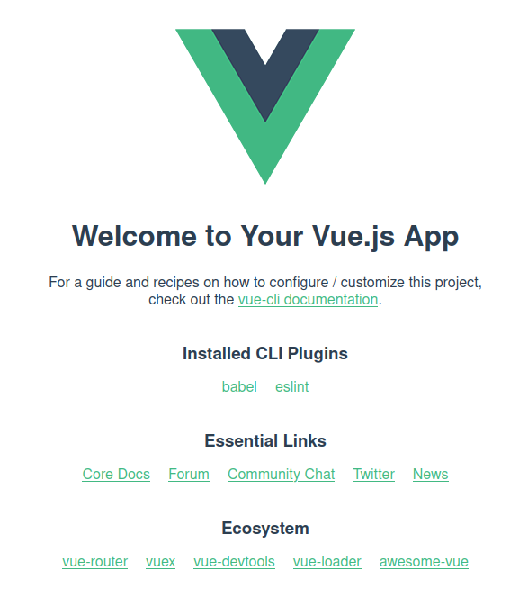

# Starting with Vue.js

<!-- slide-front-matter class: center, middle -->

<!-- START doctoc generated TOC please keep comment here to allow auto update -->
<!-- DON'T EDIT THIS SECTION, INSTEAD RE-RUN doctoc TO UPDATE -->


- [What Is Vue.js?](#what-is-vuejs)
- [Why begin with Vue.js?](#why-begin-with-vuejs)
- [Key Characteristics](#key-characteristics)
- [Let's start coding with Vue.js !](#lets-start-coding-with-vuejs-)
- [Getting started with vue-cli](#getting-started-with-vue-cli)
- [Create your first vue.js 3.0 project](#create-your-first-vuejs-30-project)
- [Welcome :) !!](#welcome--)
- [Declarative Rendering](#declarative-rendering)
- [Deep Dive Within Vue.js Directives](#deep-dive-within-vuejs-directives)
- [Conditional rendering with _v-if_](#conditional-rendering-with-_v-if_)
  - [In basic HTML/JS](#in-basic-htmljs)
  - [In Vue.js](#in-vuejs)
- [List rendering with _v-for_](#list-rendering-with-_v-for_)
  - [In basic HTML/JS](#in-basic-htmljs-1)
  - [In Vue.js](#in-vuejs-1)
  - [How to add an element dynamically to this list?](#how-to-add-an-element-dynamically-to-this-list)
- [Form input bindings with _v-model_](#form-input-bindings-with-_v-model_)
  - [In basic HTML/JS](#in-basic-htmljs-2)
  - [/// In Vue.js](#-in-vuejs)
- [Data binding with _v-bind_](#data-binding-with-_v-bind_)
  - [/// In basic HTML/JS](#-in-basic-htmljs)
  - [/// In Vue.js](#-in-vuejs-1)
- [Event handeling with _v-on_](#event-handeling-with-_v-on_)
  - [/// In basic HTML/JS](#-in-basic-htmljs-1)
  - [/// In Vue.js](#-in-vuejs-2)
- [Summary Vue.js Directives](#summary-vuejs-directives)
- [Components in Vue.js](#components-in-vuejs)
- [What is a component and why should I care?](#what-is-a-component-and-why-should-i-care)
- [Thinking in components](#thinking-in-components)
- [Component Architecture](#component-architecture)
- [Component Example: step by step](#component-example-step-by-step)
- [Lifecycle](#lifecycle)
- [Components Communication in vue.js](#components-communication-in-vuejs)
- [Communication Parent -> Child: The Props](#communication-parent---child-the-props)
  - [/// Parent](#-parent)
  - [/// Child](#-child)
- [Communication Child -> Parent: Custom Events](#communication-child---parent-custom-events)
  - [/// Child](#-child-1)
  - [/// Parent](#-parent-1)
- [Cheat Sheet Components](#cheat-sheet-components)
- [Full example: To-Do List](#full-example-to-do-list)
- [\* _Bamf_ \* Teleport (new feature Vuejs 3.0)](#%5C-_bamf_-%5C-teleport-new-feature-vuejs-30)
  - [/// In Vue.js](#-in-vuejs-3)
- [Some Best Practices](#some-best-practices)

<!-- END doctoc generated TOC please keep comment here to allow auto update -->

## What Is Vue.js?

- An open-source model–view–view model (MVVM) front end JavaScript framework for building user interfaces and single-page applications.
- Created by Evan You in 2013
- Last release (September 18, 2020): **Vue 3.0**

[From Wikipedia][wiki-vuejs]

## Why begin with Vue.js?

- Gentle Learning Curve
- Modular and Flexible
- Easy to start with vue-CLI
- Popular
- [Extensive documentation][extent-doc]

[Documentation In French][french-doc]

## Key Characteristics


[Source][vue-characteristics]

## Let's start coding with Vue.js !

<!-- slide-front-matter class: center, middle -->

## Getting started with vue-cli

The first step is to install vue-CLI (Command Line Interface).

```cmd
npm install -g @vue/cli
```

_Vue-CLI allows you to start up a vue.js 3.0 easily and rapidly._

## Create your first vue.js 3.0 project

1. Create a new project Vue.js 3.0

```cmd
vue create your_project_name
```

2. Choose vue.js 3.0 option

   > Default (Vue 3 Preview)

3. Enter to your new project directory

```cmd
cd your_project_name
```

4. Launch your project

```cmd
npm run serve
```

## Welcome :) !!

<p align="center">
  
</p>

**Let's check the code !**

## Declarative Rendering

The declarative rendering enables to declaratively render data to the DOM !

<u>Syntax</u>: `{{ <expression> }}`

```html
[HTML]
<div id="counter">Counter: {{ counter }}</div>
```

```js
[JS];
export default {
  data: () => {
    counter: 0;
  }
};
```

## Deep Dive Within Vue.js Directives

<!-- slide-front-matter class: center, middle -->

## Conditional rendering with _v-if_

The directive `v-if` is used to conditionally render a block. The block will only be rendered if the directive's expression returns a value: `True`

[Link to the documentation][vue-doc-if]

### In basic HTML/JS

```html
[HTML]
<span id="span1" display="block">Hello</span>
<span id="span2" display="block">World !</span>
```

```js
[JS];
const conditional_expression = false;
if (conditional_expression) {
  document.getElementById("span1").style.display = "block";
  document.getElementById("span2").style.display = "none";
} else {
  document.getElementById("span1").style.display = "none";
  document.getElementById("span2").style.display = "block";
}
```

> An important note here: the blocks are only hidden using the CSS style `display` property. This means that each blocks are still present in the DOM.

### In Vue.js

```html
[HTML]
<span v-if="conditional_expression">Hello</span>
<span v-else>World !</span>
```

```js
[JS];
export default {
  data: () => {
    conditional_expression: false;
  }
};
```

> Using `v-if`, VueJS will remove the element from the DOM entirely if the condition is falsy.

## List rendering with _v-for_

The directive `v-for` is used to render a list of items based on an collection.

The `v-for` directive requires a special syntax in the form of `<element> of <collection>`, where `<collection>` is the source collection from your component and `<element>` is a **template variable** that will contain the current element from the collection being iterated on.

To better predict how exactly the DOM will be rendered you need to use the `v-bind:key` attribute.

[Link to the documentation][vue-doc-for]

### In basic HTML/JS

```html
[HTML]
<ul id="myfruits-list">
  <!-- Element will be created inside this list -->
</ul>
```

```js
[JS];
const fruits = ["Apple", "Kiwi", "Orange"];
const list = document.getElementById("myfruits-list");

for (const fruits of fruits) {
  const liEle = document.createElement("li");
  liEle.innerText = fruit;
  list.appendChild(liEle);
}
```

### In Vue.js

```html
[HTML]
<ul id="myfruits-list">
  <li v-for="fruit in fruits" :key="fruit"></li>
</ul>
```

```js
[JS];
export default {
  data: () => {
    fruits: ["Apple", "Kiwi", "Orange"];
  }
};
```

### How to add an element dynamically to this list?

**In basic JS**

```js
let ul = document.getElementById("myfruits-list");
let li = document.createElement("li");
li.innerText = "Pienapple";
ul.appendChild(li);
```

**In Vue.js**

```js
// Just call this somewhere in your methods
fruits.push("Pineapple");
```

## Form input bindings with _v-model_

The directive `v-model` is used to create two-way bindings on form input, textarea, and select elements. It automatically picks the correct way to update the element based on the input type.

[Link to the documentation][vue-doc-model]

### In basic HTML/JS

```html
[HTML]
<p id="my-message">your text is...</p>
<input name="input-message" />
```

```js
[JS];
const input = document.querySelector("input")[0];
const log = document.getElementById("my-message");

input.addEventListener("input", updateValue);

function updateValue(e) {
  log.textContent = e.target.value;
}
```

> \* type _Hello MDT-GIO-1_ in input \*

> \>> mymessage = "Hello MDT-GIO-1!"

### /// In Vue.js

```html
[HTML]
<p>{{ mymessage }}</p>
<input v-model="mymessage" />
```

```js
[JS];
export default {
  data: () => {
    mymessage = "your text is...";
  }
};
```

> \* type _Hello MDT-GIO-1_ in input \*

> \>> mymessage = "Hello MDT-GIO-1!"

## Data binding with _v-bind_

The directive `v-bind` is used to dynamically bind one (or more) attributes, or a component prop to an expression.
When used to bind the `class` or `style` attribute, it supports additional value types such as Array or Objects.

<sup>[**Link to the documentation: class binding**][vue-doc-bindclass]</sup>

When used for prop binding, the prop must be properly declared in the child component.

<sup>[**Link to the documentation: prop binding**][vue-doc-bindprop]</sup>

### /// In basic HTML/JS

```html
[HTML]
<p id="my-text" class="text-right">This is the magic text</p>
```

```js
[JS];
let letext = document.getElementById("my-text");
letext.classList.remove("text-right");
letext.classList.add("text-center");
```

```css
[CSS] .text-center {
  text-align: center;
}
.text-right {
  text-align: right;
}
```

> \>> <p style='text-align:center'>This is the magic text</p>

### /// In Vue.js

```html
[HTML]
<div v-bind:class="iscenter?'text-center':'text-right'">
  This is the magic text
</div>
```

```js
[JS];
let iscenter = true;
```

```css
[CSS] .text-center {
  text-align: center;
}
.text-right {
  text-align: right;
}
```

> \>> <p style='text-align:center'>This is the magic text</p>

## Event handeling with _v-on_

The directive `v-on` is used to listen to DOM events and run some JavaScript when they're triggered.

<u>Shorthand</u>: `@`

<sup>[**Link to the documentation**][vue-doc-event]</sup>

### /// In basic HTML/JS

```html
[HTML]
<button onclick="addonetocounter()">Add 1</button>
<p id="my-counter">0</p>
```

```js
[JS];
let countervalue = 0;
function addonetocounter() {
  countervalue++;
  document.getElementById("my-counter").innerHTML = countervalue;
}
```

> \* Click _Add 1_ \*

> \>> counter = 1

### /// In Vue.js

```html
[HTML]
<button v-on:click="mycounter += 1">Add 1</button>
<p>{{ mycounter }}</p>
```

```js
[JS];
let mycounter = 0;
```

> \* Click _Add 1_ \*

> \>> counter = 1

## Summary Vue.js Directives

- `v-if`: Conditional rendering
- `v-for`: List rendering
- `v-model`: Form input bindings
- `v-bind`: Data binding
- `v-on`: Event handeling

## Components in Vue.js

<!-- slide-front-matter class: center, middle -->

## What is a component and why should I care?

Components are reusable instances with a name. We can use components as a custom element inside a root instance. They can have different size from a full page to a button.

There is a several way to declare a component (basic, inline, functional, single file), in this class we will use single file components because it is the most versatile.

<sup>[**Link to the documentation**][vue-doc-cpt]</sup>

<br>
**Let's check out our started up project to understand what does it mean.**

## Thinking in components

<p align="center">
  
</p>
<sup>[**Source**][cpt-composition]</sup>

## Component Architecture

<sup>[**Source**][cpt-architecture-img]</sup>

[**An Example To Check Out!**][cpt-example]

## Component Example: step by step

<!-- slide-front-matter class: center, middle -->

[**Vue Component**][cpt-step-by-step]

## Lifecycle

<p align="center">
  
</p>
<sup>[**Source**][vue-hooks]</sup>

## Components Communication in vue.js

"_Blabla?_" said The Parent Component _\* <u>pass props</u> \*_,

"_Bla..._" answered The Child Component _\* <u>send event</u> \*_.

<br>
<p align="center">
  
</p>
<sup>[**Source**][vue-cpt-communication]</sup>

## Communication Parent -> Child: The Props

Props are custom attributes registered on a component. When a value is passed to a prop attribute, it becomes a property on that component instance.

<sup>[**Link to the documentation**][vue-cpt-props]</sup>

### /// Parent

```html
[Template Parent]
<template>
  <!-- Declare my component in the parent and add the bind value that you want to transmit -->
  <TheComponent :myprop-value="Cookie"></TheComponent>
</template>
<script>
  import TheComponent from "./cpt/thecomponent.vue"; // name - pathway of the component

  export default {
    components: {
      TheComponent // declaration of the component
    }
  };
</script>
```

### /// Child

```html
[Template Child]
<template>
  <p>I want my {{mypropValue}}!</p>
</template>
<script>
  export default {
    name: "TheComponent", // name of the component
    props: {
      mypropValue: {
        type: String, // Number, Boolean, Array, Object, Function, Promise
        required: true
        //default: default value
        //validator
      }
    }
  };
</script>
```

## Communication Child -> Parent: Custom Events

Custom event are used to signal from a child component to notify a parent component that an event has taken place.

<sup>[**Link to the documentation**][vue-cpt-event]</sup>

[**Further reading on custom event**][cpt-event-example]

### /// Child

```html
[Template Child]
<button @click="sayhi">Says hi from component!</button>
<script>
  export default {
    emits: ["hello-stranger"], // declare all emit events, optional but highly recommended !
    methods: {
      sayhi() {
        this.$emit("hello-stranger" /*some data*/); // emit event: "hello-stranger"
      }
    }
  };
</script>
```

### /// Parent

```html
[Template Parent]
<!-- Declare my component in the parent and add the event listerner -->
<TheComponent @hello-stranger="someonesayshi"></TheComponent>

<script>
  import TheComponent from "./cpt/thecomponent.vue"; // name - pathway of the component

  export default {
    components: {
      TheComponent // declaration of the component
    },
    methods: {
      someonesayshi() {
        console.log("What a beautiful day!");
      }
    }
  };
</script>
```

## Cheat Sheet Components

<p align="center">
  
</p>
<sup>[**Source**][cpt-cheatsheet]</sup>

## Full example: To-Do List

<!-- slide-front-matter class: center, middle -->

[**Making a to-do list with Vuejs**][todo-example]

## \* _Bamf_ \* Teleport (new feature Vuejs 3.0)

Teleports are a way to keep a Template code where he should be logically located (data, event, props) and later on, to move it to different part of the DOM.

<sup>[**Link to the documentation**][vue-doc-teleport]</sup>

[**Further reading on teleport**][teleport-example]

### /// In Vue.js

```html
[HTML Target]
<p>Hello</p>
<div id="portal-target"></div>
```

```html
[HTML Template]
<template>
  <p>{{mydata}}</p>
  <teleport to='#portal-target'>
</template>
<script>
  export  default {
    data() { // data function
      return { //return object
        mydata:"World!"
      }
    }
  }
</script>
```

> Hello

> World!

## Some Best Practices

- Always use :key inside v-for
- Use kebab-case for events
- Declare props with camelCase and use kebab-case in templates
- Data should always return a function
- Don’t use v-if with v-for elements
- Use PascalCase or kebab-case for components
- Base components should be prefixed accordingly
- Components declared and used ONCE should have the prefix “The”
- Template expressions should only have basic Javascript expressions

<sup>[**Source**][vue-best-pratices]</sup>

[wiki-vuejs]: https://en.wikipedia.org/wiki/Vue.js
[extent-doc]: https://v3.vuejs.org/guide/introduction.html
[french-doc]: https://fr.vuejs.org/v2/guide/index.html
[vue-characteristics]: https://www.cmarix.com/blog/why-vuejs-is-so-popular-for-front-end-development/
[vue-doc-if]: https://v3.vuejs.org/guide/conditional.html#v-if
[vue-doc-for]: https://v3.vuejs.org/guide/list.html#mapping-an-array-to-elements-with-v-for
[vue-doc-model]: https://v3.vuejs.org/guide/forms.html#basic-usage
[vue-doc-bindclass]: https://v3.vuejs.org/guide/class-and-style.html#binding-html-classes
[vue-doc-bindprop]: https://v3.vuejs.org/guide/component-basics.html#passing-data-to-child-components-with-props
[vue-doc-event]: https://v3.vuejs.org/guide/events.html#listening-to-events
[vue-doc-cpt]: https://v3.vuejs.org/guide/single-file-component.html#introduction
[vue-doc-teleport]: https://v3.vuejs.org/guide/teleport.html#using-with-vue-components
[vue-best-pratices]: https://learnvue.co/2020/01/12-vuejs-best-practices-for-pro-developers/
[vue-hooks]: https://learnvue.co/2019/12/a-beginners-guide-to-vuejs-lifecycle-hooks/
[vue-cpt-communication]: https://learnvue.co/2020/08/an-introduction-to-vue3-props-a-beginners-guide/
[vue-cpt-props]: https://v3.vuejs.org/guide/component-props.html#prop-types
[vue-cpt-event]: https://v3.vuejs.org/guide/component-custom-events.html#event-names
[cpt-architecture-img]: https://snipcart.com/blog/vue-component-example-tutorial/
[cpt-cheatsheet]: https://medium.com/@_shirish/thinking-in-components-with-vue-js-a35b5af12df
[cpt-composition]: https://stackoverflow.com/questions/46614002/possible-to-use-vuejs-sfc-components-with-with-template-in-rendered-html
[cpt-example]: https://reactgo.com/vuejs-components-tutorial/
[cpt-step-by-step]: https://gist.github.com/thibaud-c/7aed994b552e1ca31b888d1254ff5103
[cpt-event-example]: https://www.telerik.com/blogs/how-to-emit-data-in-vue-beyond-the-vuejs-documentation
[teleport-example]: https://learnvue.co/2020/09/an-introduction-to-vue-teleport-a-new-feature-in-vue3/
[todo-example]: https://codesandbox.io/s/o29j95wx9
